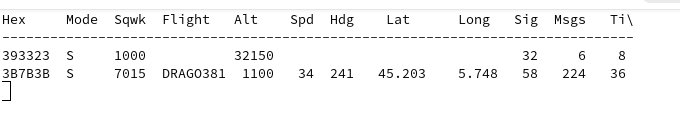

# Réception ADS-B (Avions) avec HackRF

L’**ADS-B** (Automatic Dependent Surveillance–Broadcast) est un protocole utilisé par les avions pour transmettre en continu des informations de position, de vitesse, d’identification, etc.


---

## Références

- [Article Wikipédia (en)](https://en.wikipedia.org/wiki/Automatic_Dependent_Surveillance%E2%80%93Broadcast)
- [Signal Identification Wiki (SIGIDWiki)](https://www.sigidwiki.com/wiki/ADS-B)

D’après SIGIDWiki :

> *Automatic Dependent Surveillance–Broadcast (ADS-B) is used by aircraft as an alternative to secondary radar. It broadcasts GPS position (latitude, longitude), pressure altitude, callsign, as well as track and ground speed separated into messages carrying 10 bytes of data each. ADS-B uses PPM to transmit data.*

---

## Fréquences utilisées

- **1090 MHz** – Standard mondial, via transpondeur Mode-S (DF17)
- **978 MHz** – UAT (Universal Access Transceiver), utilisé principalement aux États-Unis
- **1030 MHz** – Fréquence associée aux requêtes radar secondaires (SSR)

---

## Types d’ADS-B

- **1090ES (Extended Squitter)** – Utilise le transpondeur SSR à 1090 MHz, 2 MHz de bande passante. (monde entier)
- **978 MHz UAT** – 1.3 MHz de bande passante, peut aussi transmettre des données météo (États-Unis uniquement)

---

## Logiciel : `dump1090`

### Dépôts Git

- [Version compatible HackRF (fork)](https://github.com/esuldin/dump1090)
- [Dépôt original (non HackRF)](https://github.com/MalcolmRobb/dump1090)

### Exécution avec HackRF One

```bash
./dump1090 --interactive
````

> À tester selon les capacités de réception — le comportement avec HackRF One peut varier selon le fork utilisé.

### Options utiles

* `--aggressive` : active une correction d’erreur agressive (peut générer des faux positifs si le trafic est dense).
* `--fix` : tente de corriger certains messages partiellement corrompus.


Exemple de commande complète :

```bash
./dump1090 --aggressive --fix --interactive
```

---

## Capture d’écran

Voici un exemple d’affichage interactif en ligne de commande (`--interactive`) avec réception active :



> *Assurez-vous que l’antenne utilisée est bien adaptée aux fréquences autour de 1 GHz pour de bons résultats.*

---

## Remarques

* Le HackRF n’est pas aussi sensible qu’un dongle RTL-SDR dédié aux fréquences ADS-B. Des performances moindres sont possibles, surtout sans antenne adaptée.
* Pour une réception fiable, utiliser une antenne accordée à 1090 MHz, idéalement en extérieur ou avec vue dégagée du ciel.


